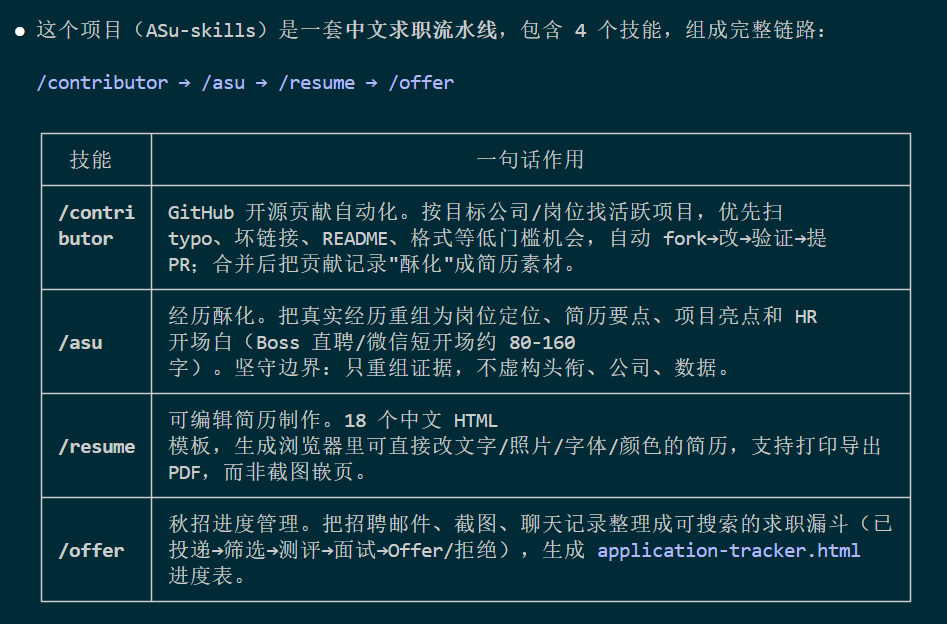

# 将 ASu-skills 安装到 Claude Code


## 一、前置条件

- 已安装 Claude Code（`npm install -g @anthropic-ai/claude-code`，或桌面版）

## 二、安装方式（三选一）

### 方式 1：项目级安装（仅当前项目可用，推荐）

把 skills 放进你的工作项目根目录的 `.claude/skills/`：

```bash
# 进入你的工作项目
cd /path/to/your-project

# 创建目录
mkdir -p .claude/skills

# 复制四个 skill
cp -r ./skills/asu          .claude/skills/
cp -r ./skills/contributor  .claude/skills/
cp -r ./skills/resume       .claude/skills/
cp -r ./skills/offer        .claude/skills/
```

Windows PowerShell 版：

```powershell
New-Item -ItemType Directory -Path .claude/skills -Force | Out-Null
Copy-Item "D:\DevProject\ASu-skills\skills\asu","D:\DevProject\ASu-skills\skills\contributor","D:\DevProject\ASu-skills\skills\resume","D:\DevProject\ASu-skills\skills\offer" -Destination .claude/skills -Recurse
```

**最终目录结构（每项必须含 `SKILL.md`）：**

```text
your-project/
└── .claude/
    └── skills/
        ├── asu/SKILL.md
        ├── contributor/SKILL.md
        ├── resume/SKILL.md
        └── offer/SKILL.md
```

### 方式 2：用户级安装（本机所有项目可用）

复制位置改为：

- macOS / Linux：`~/.claude/skills/`
- Windows：`%USERPROFILE%\.claude\skills\`

命令同上，把目标目录换成上面路径即可。


## 三、验证安装

1. **重启 Claude Code**（必须，让新技能加载）；
2. 对话中输入：`你有哪些技能？` 或 `列出已加载的 skills`；
3. 应看到 `asu`、`contributor`、`resume`、`offer` 四个技能；
4. 也可以直接触发测试：`请用 asu 技能把我的实习经历改写成适合 AI 应用工程师岗位的版本`。


## 四、使用示例

Claude Code 根据 `description` 自动匹配技能，直接说人话即可：

```text
# 触发 /asu —— 经历酥化
请酥化我下面的实习经历：目标岗位是 AI 应用工程师，给出稳妥版和进取版定位，并生成一段发 HR 的开场白。

# 触发 /resume —— 简历制作
根据我的教育、实习和项目经历，生成一份可编辑的中文 HTML 简历，并告诉我如何导出 PDF。

# 触发 /offer —— 秋招进度
把这些招聘邮件和截图整理成秋招进度表，列出每家公司下一步要做什么。

# 触发 /contributor —— 开源贡献
请帮我找 3 个容易合并的 GitHub 小 PR（typo、README 修复），技术栈 TypeScript、React。
```

## 五、注意事项

| 事项 | 说明 |
| --- | --- |
| `agents/openai.yaml` | Codex 专属配置，Claude Code 会忽略，保留或删除均可 |
| `/contributor` 权限 | 自动 fork + 提 PR 需要 git/GitHub CLI 权限，可用 `/permissions` 授权，或启动时加 `--dangerously-skip-permissions`（不推荐） |
| 项目级安装与 git | `.claude/skills` 默认会进 git，适合团队共享；若只想自己用，请改用方式 2 或加入 `.gitignore` |
| 路径问题 | 技能目录内若有相对路径引用资源（如 `resume` 引用的模板），确保整个 skill 文件夹完整复制，不要只拷 `SKILL.md` |

## 六、卸载

macOS / Linux（Bash）：

```bash
# 项目级
rm -rf .claude/skills/asu .claude/skills/contributor .claude/skills/resume .claude/skills/offer

# 用户级
rm -rf ~/.claude/skills/asu ~/.claude/skills/contributor ~/.claude/skills/resume ~/.claude/skills/offer
```

Windows PowerShell：

```powershell
# 项目级
Remove-Item -Path .claude\skills\asu,.claude\skills\contributor,.claude\skills\resume,.claude\skills\offer -Recurse -Force

# 用户级
Remove-Item -Path "$env:USERPROFILE\.claude\skills\asu","$env:USERPROFILE\.claude\skills\contributor","$env:USERPROFILE\.claude\skills\resume","$env:USERPROFILE\.claude\skills\offer" -Recurse -Force
```
