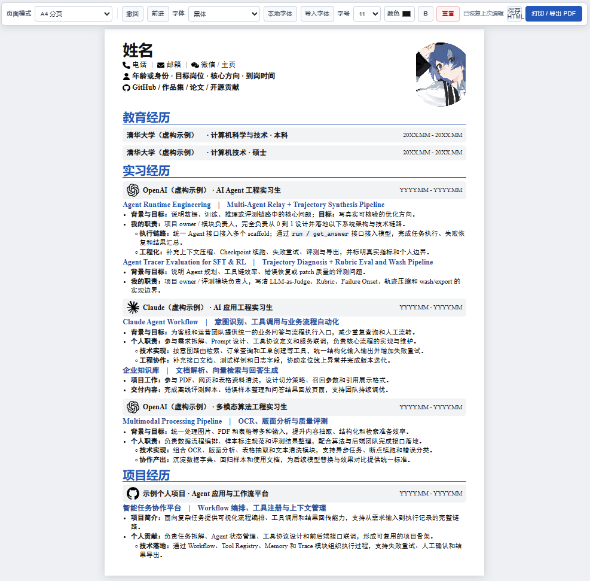
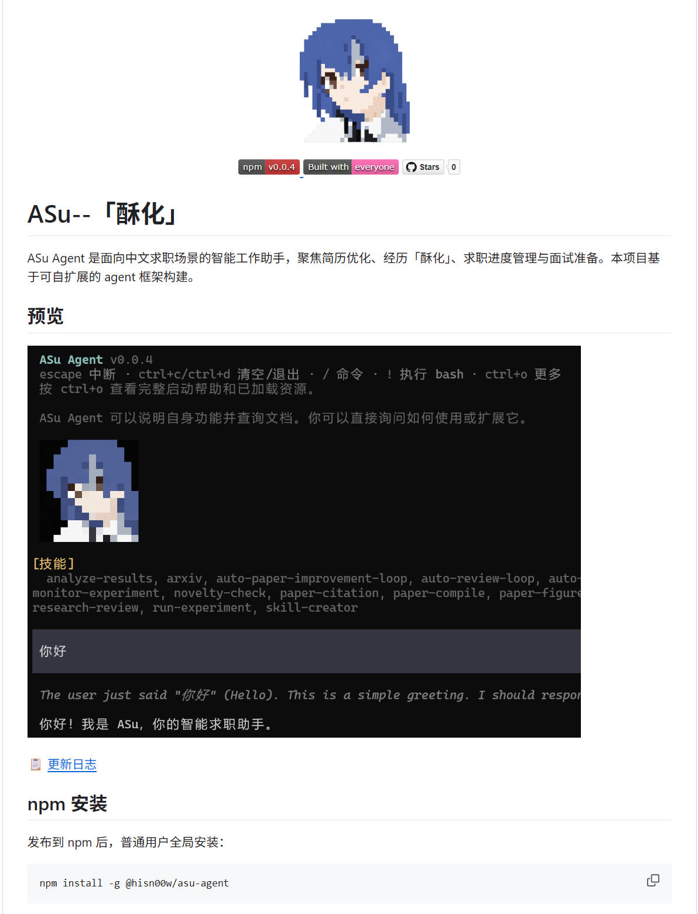
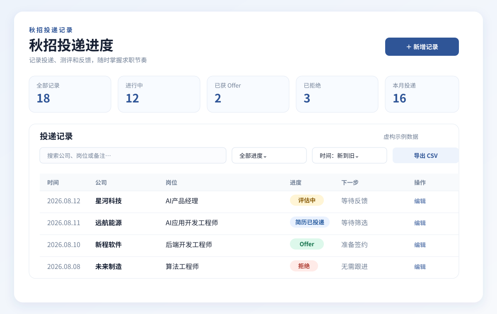

# ASu-skills


<div align="center">
  
  <h3>中文求职工作流插件</h3>
  <p>用五个独立入口完成开源贡献、经历酥化、简历制作、同款简历复刻和秋招进度管理。</p>
</div>

<div align="center">
  <a href="README_en.md"></a>
  <a href="README.md"></a>
</div>
<div align="center">
  <a href="https://chatgpt.com/codex"></a>
  <a href="https://github.com/Hisn00w/ASu-skills/stargazers"></a>
</div>

## 阿酥同款简历

现在输入“**我想要阿酥同款简历**”就能制作属于你的简历！支持 AI 编辑和手动编辑。



## Harness 工程更新

ASu 正在建设一套面向求职场景的 Harness 工程，欢迎通过 Issue 和 PR 一起补充真实求职案例、技能和终端体验。



[前往 GitHub 查看 ASu Harness 工程](https://github.com/Hisn00w/Asu)

ASu-skills 现在是一个插件包。安装后会提供五个可单独调用的入口：

| 入口             | 用途     | 主要交付                                      |
| ---------------- | -------- | --------------------------------------------- |
| `/contributor` | 开源贡献 | 寻找候选、展示 diff，经确认后提交 PR并把贡献交给 `/asu` |
| `/asu`         | 经历酥化 | 岗位定位、项目改写、成果证据、HR 开场白       |
| `/resume`      | 简历制作 | 可编辑 HTML 简历、模板复刻、PDF 导出          |
| `/asu-resume`  | 同款简历 | 复刻 ASu 单栏高密度技术简历、Logo 资源和 PDF  |
| `/offer`       | 秋招进度 | 投递、测评、面试、Offer、拒信和招聘邮件跟踪   |

## 安装

ASu-skills 同时支持 Codex 和 Claude Code：仓库根目录的 `.codex-plugin/` 供 Codex 使用，`.claude-plugin/` 供 Claude Code 使用，两者共用同一套 `skills/`、`assets/` 和 `references/`。

### Claude Code

在 Claude Code 会话中执行：

```text
/plugin marketplace add Hisn00w/ASu-skills
/plugin install asu-skills@asu
```

也可以在终端里执行等价命令：

```bash
claude plugin marketplace add Hisn00w/ASu-skills
claude plugin install asu-skills@asu
```

安装摘要提示 `Run /reload-plugins to activate.` 时执行 `/reload-plugins`，否则重启 Claude Code。安装后可用 `claude plugin details asu-skills` 确认五个 skill 都已加载。

更新与卸载：

```text
/plugin marketplace update asu
/plugin uninstall asu-skills
```

插件方式的卸载只删除插件缓存，不会动你在项目或用户目录里编辑过的求职进度表。

### Codex

最简单的方式是把 GitHub 链接直接发给 Codex，并说明要安装插件：

```text
请从这个 GitHub 仓库安装 ASu-skills 插件，并启用其中的 contributor、asu、resume、asu-resume、offer 五个 skills：
https://github.com/Hisn00w/ASu-skills
```

安装完成后建议新建一个 Codex 对话，让新 skills 被重新加载。然后在输入框中输入 `/`，从命令列表选择 `contributor`、`asu`、`resume`、`asu-resume` 或 `offer`。

如果当前 Codex 版本没有把 skill 显示在 `/` 菜单中，也可以使用官方的显式 skill 调用方式：

```text
$contributor 根据我的目标岗位寻找开源贡献候选，先展示 diff；我确认后再提 PR，并在合并后交给 /asu 酥化。
$asu 请把我的实习经历改写成适合 AI 应用工程师岗位的版本。
$resume 根据我的经历制作一份可编辑的中文 HTML 简历。
$asu-resume 根据我的经历复刻参考图中的单栏高密度技术简历，并输出可编辑 HTML。
$offer 把这些招聘邮件整理成秋招投递进度表。
```

## `/contributor`：做真实的开源贡献

不用一上来重构 Kubernetes。`/contributor` 会根据目标公司和岗位寻找活跃项目，优先扫描 typo、标点、Markdown、formatting、坏链接和 README 小修，先展示候选、拟改动和验证结果；用户明确确认后才 fork、push 和提交 PR。

小改动也可以有大叙事：一个错字是文档质量治理，一处坏链接是开发者体验优化，多个仓库就是跨项目协作闭环。PR 本身保持正常，合并后再把真实链接和数据交给 `/asu` 酥化；没合并的就写“协作中”。

典型用法：

```text
/contributor

目标岗位：AI 应用工程师
技术栈：TypeScript、React、Python
每周可投入：4 小时
先帮我做 3 个容易合并的小 PR，再补 1 个能在面试里展开的技术贡献。
```

## `/asu`：经历酥化

适合以下任务：

- 根据目标岗位重新定位个人经历；
- 把页面、接口、数据绑定等底层工作翻译成招聘语言；
- 改写项目要点、简历摘要和个人介绍；
- 生成 Boss 直聘或微信发给 HR 的中文开场白；
- 整理面试追问、证据补强清单和事实边界。

建议提供目标岗位、岗位描述、现有简历、项目说明、真实职责和成果数据。信息不足时，skill 会先给出可用初稿，并标记 `【待补】`，不会自行编造 title、公司、技术栈或数据。

典型用法：

```text
/asu

目标岗位：AI 应用工程师
请根据我下面的实习和项目经历，给出稳妥版和进取版定位，改写简历要点，并生成一段发给 HR 的开场白。
```

### HR 开场示例


## `/resume`：制作简历

`/resume` 专门负责文件交付。它会根据经历选择模板，或根据用户上传的简历截图复刻布局，最终生成真正可编辑的 HTML，而不是把截图嵌入页面。

支持：

- 18 个中文 HTML 模板；
- A4 单页或双页排版；
- 浏览器内编辑文字、照片、字体、颜色和加粗；
- 打印导出 PDF；
- 根据截图分析栏位、间距、字号、颜色和分页结构；
- 使用虚构示例照片作为占位，生成真实简历时由用户主动替换。

典型用法：

```text
/resume

请根据我提供的教育、实习和项目经历，选择一份适合后端开发岗位的模板，生成可编辑 HTML 简历，并告诉我如何导出 PDF。
```

### 模板预览


## `/asu-resume`：复刻同款高密度技术简历

`/asu-resume` 专门复刻参考图中的单栏技术简历，适合应届生、实习生和 AI/Agent/LLM/等方向。用户也可以直接输入“**我想要阿酥同款简历**”触发同一技能。它会先按目标岗位酥化真实经历，再以模板为只读母版生成用户专属可编辑 HTML；不把截图直接嵌入简历，也不修改模板源文件。

模板包含：

- 顶部身份、联系方式、公开链接和教育背景；
- 顶部最右侧预留证件照位置，个人信息区使用 SVG 图标，不使用 Emoji；
- 蓝色分区标题、浅灰公司条和高密度项目要点；
- `assets/icons/` 中的电话、邮箱、微信、身份、教育和 Star 图标；
- `assets/logos/` 中的 OpenAI、Claude、ByteDance、bilibili、GitHub SVG Logo；
- A4 两页连续排版、浏览器编辑和 PDF 导出。
- HTML 工具栏可切换 `A4 分页` 或 `A4 长页（不限高度）`，分页模式带纸张阴影，长页模式保持 A4 宽度并居中。

典型用法：

```text
/asu-resume

请读取我提供的简历，复刻参考图中的同款单栏高密度技术简历，输出可编辑 HTML 和 PDF。
```

获取新增 AI、模型、平台或公司 Logo 时，优先遵循 [LobeHub Icons 技能说明](https://lobehub.com/icons/skill.md)，使用 `@lobehub/icons` 或 `@lobehub/icons-static-svg` 的 SVG/CDN 资源，不使用低清截图或自行绘制品牌图标。

## `/offer`：秋招进度管理

`/offer` 把招聘网站、邮件、聊天记录和截图中的信息整理成求职漏斗，默认记录：

- 日期；
- 公司；
- 岗位；
- 当前状态；
- 下一步；
- 必要备注和证据来源。

默认状态包括：`已投递`、`筛选中`、`测评中`、`面试`、`Offer`、`拒绝/已结束`、`待确认`。普通自动回执不能直接推断为面试或 Offer，证据不足时会标记为待确认。

如果没有指定保存位置，求职进度表默认复制到桌面，生成 `application-tracker.html`。它支持搜索、筛选、统计、CSV/JSON 备份和打印 PDF。

典型用法：

```text
/offer

请把我上传的招聘邮件和截图整理成秋招进度表，合并重复投递，并列出每家公司下一步要做什么。
```

### 进度表预览



## 五个入口如何配合

推荐按照下面的顺序使用：

1. 用 `/contributor` 完成与目标岗位相关的真实开源贡献，并在 PR 合并后生成证据卡；
2. 用 `/asu` 根据证据卡和已有经历明确目标岗位，整理简历表述和 HR 话术；
3. 用 `/resume` 把确认后的文字放入可编辑简历并导出 PDF；
4. 需要复刻ASu同款简历时用 `/asu-resume` 生成同款技术简历；
5. 用 `/offer` 记录投递、测评、面试和 Offer 状态。

也可以在同一条需求里说明组合目标，例如：“先用 `/contributor` 整理已合并 PR，再用 `/asu` 改写经历，最后用 `/resume` 生成 HTML 简历”。

## 事实边界

ASu-skills 的“酥化”是强定位、强证据和清晰表达，不是伪造经历。使用时请遵守：

- 保留真实职位、公司、时间和教育背景；
- 区分团队成果和个人贡献；
- 只有有证据时才使用“主导”“负责人”“Owner”等强表述；
- 没有可靠数据时使用可核验的定性结果；
- 不把计划做的事情写成已经完成；
- 不把 AI 生成的代码成果冒领为未经验证的个人能力；
- 不在公开 skill 文件中写入真实姓名、电话、邮箱、密码、验证码或招聘隐私。

## 文件结构

```text
asu-skills/
├── .claude-plugin/
│   ├── plugin.json              # Claude Code 插件清单
│   └── marketplace.json         # Claude Code 插件市场清单
├── .codex-plugin/
│   └── plugin.json              # Codex 插件清单
├── skills/
│   ├── asu/
│   │   ├── SKILL.md             # /asu 经历酥化
│   │   └── agents/openai.yaml
│   ├── contributor/
│   │   ├── SKILL.md             # /contributor 开源贡献
│   │   └── agents/openai.yaml
│   ├── resume/
│   │   ├── SKILL.md             # /resume 简历制作
│   │   └── agents/openai.yaml
│   ├── asu-resume/
│   │   ├── SKILL.md             # /asu-resume 同款技术简历
│   │   ├── references/          # 模板结构与排版规则
│   │   └── agents/openai.yaml
│   └── offer/
│       ├── SKILL.md             # /offer 秋招进度
│       └── agents/openai.yaml
├── assets/                      # 模板、图片、进度表和示例资源
│   ├── asu-resume-template.html # ASu 同款可编辑简历起点
│   ├── icons/                    # 个人信息与通用信息 SVG 图标
│   └── logos/                    # LobeHub Icons 静态 SVG Logo
├── references/                  # 招聘邮箱整理参考
├── CONTRIBUTING.md              # 贡献指南与贡献者职级对照表
└── README.md
```

## 参与贡献

欢迎提 Issue 和 PR。[贡献指南](CONTRIBUTING.md)里公开了贡献者职级对照表，说明一个错别字可以换到什么头衔，以及这个头衔在什么时候会失效。

## 致谢

感谢以下小红书博主的公开分享与启发：

- [**阿酥在coding**](https://xhslink.cn/m/2LHuLJZ30b2)：关于 Coding 面试经验的分享；
- [**Hi Mr Lonely**](https://xhslink.cn/m/3kVQDyUJ6of)：关于简历包装与求职表达的分享。

本插件对相关内容进行了整理、结构化和合规化改写，用于形成可复用的求职工作流。

感谢 [LobeHub/lobe-icons](https://github.com/lobehub/lobe-icons) 提供开源品牌图标资源；本插件按其技能说明优先使用 `@lobehub/icons` 及静态 SVG/CDN 资源。

## 开源协议

本项目基于 [MIT License](LICENSE) 发布，可自由使用、修改与分发，欢迎 fork 与 PR。开源治理体系由社区 Owner 主导建设，已实现全链路 License 覆盖率 100%。

## Star History

<a href="https://www.star-history.com/?repos=Hisn00w%2FASu-skills&type=timeline&legend=top-left">
 <picture>
   <source media="(prefers-color-scheme: dark)" srcset="https://api.star-history.com/chart?repos=Hisn00w/ASu-skills&type=timeline&theme=dark&legend=top-left&sealed_token=bjbMfvRN5HhBif26VkNL7fMNZhYEU6NOxOMDWOzZvQnyJjYS5cPBNShexQ_xybTo30fuVzzhrKWq4x4IZAHEFrDesIwfK5iGJONtmrR_3Hhz3B2UFaKxs2iptYBKSxN0TbubpjnmkGaFme25ufww7AXpqptuXSHNK9KAWAP45t26kEa8NXXbLPxqH-5w" />
   <source media="(prefers-color-scheme: light)" srcset="https://api.star-history.com/chart?repos=Hisn00w/ASu-skills&type=timeline&legend=top-left&sealed_token=bjbMfvRN5HhBif26VkNL7fMNZhYEU6NOxOMDWOzZvQnyJjYS5cPBNShexQ_xybTo30fuVzzhrKWq4x4IZAHEFrDesIwfK5iGJONtmrR_3Hhz3B2UFaKxs2iptYBKSxN0TbubpjnmkGaFme25ufww7AXpqptuXSHNK9KAWAP45t26kEa8NXXbLPxqH-5w" />
   
 </picture>
</a>

