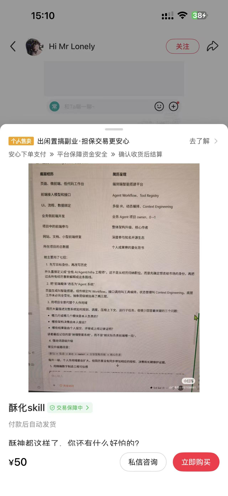

# ASu-skills

<div align="center">
  
  <h3>中文简历包装与 HR 开场自我介绍技能</h3>
  <p>把零散经历整理成清晰、有证据、匹配岗位的求职表达。</p>
</div>

## 技能简介

ASu-skills 用于简历包装、项目经历改写、岗位定位，以及 Boss 直聘和微信场景下的 HR 开场自我介绍。

它会帮助你：

- 提炼一句话职业定位和目标岗位标签；
- 将基础工作翻译成清晰的系统能力和业务价值；
- 强化项目复杂度、个人贡献和成果证据；
- 生成简历摘要、项目要点和 HR 开场白；
- 处理面试压力、岗位标签、跨公司经历和 AI 辅助开发的表达；
- 用“主张—证据—范围—风险”审计包装内容，避免无依据夸大。

## 调用方式

在 Codex 中使用：

```text
我要酥化
```

也可以显式调用技能：

```text
使用 $asu-skills，根据我的经历和目标岗位，帮我包装简历并写一段发给 HR 的中文自我介绍。
```

提供以下信息，效果会更好：

1. 目标岗位或岗位描述；
2. 当前简历、项目经历或作品集；
3. 真实职责、成果数据和个人贡献；
4. 求职渠道和期望语气。

## 安装教程

GitHub 仓库：[https://github.com/Hisn00w/ASu-skills](https://github.com/Hisn00w/ASu-skills)

把下面这句话和仓库链接直接发给 Codex：

```text
请从这个 GitHub 仓库安装 ASu-skills 技能：
https://github.com/Hisn00w/ASu-skills
```

安装完成后，在 Codex 中输入：

```text
我要酥化
```

如果 Codex 询问要安装哪个技能，选择 `asu-skills` 即可。

## 默认输出

1. 一句话职业定位；
2. 简历顶部摘要；
3. 项目经历改写；
4. Boss 直聘 / 微信 HR 开场白；
5. 证据补强清单；
6. HR 可能追问。

## 参考示例

下面是 Boss 直聘场景下的 HR 开场自我介绍示例。使用时应替换为自己的真实经历、职责和成果，不要直接照搬其中的身份、公司、项目或数据。

<div align="center">
  
</div>

### 从底层经历到简历呈现

核心不是“把普通经历吹成大厂经历”，而是把底层工作翻译成目标岗位能理解的系统能力，再用项目证据证明个人贡献。ASu-skills 已将这套方法写入 `SKILL.md`，调用“我要酥化”时会自动遵循。

| 底层经历                   | 简历呈现方向                           | 使用时要补充                         |
| -------------------------- | -------------------------------------- | ------------------------------------ |
| 页面、微前端、低代码工作台 | 端到端智能搭建平台                     | 实际负责的页面、组件、平台模块和结果 |
| 前端接入模型和接口         | Agent Workflow、Tool Registry          | 模型/工具接入方式和个人代码范围      |
| UI、流程、数据绑定         | 多级 IR、动态编排、Context Engineering | 只有实际参与相关设计时才能使用       |
| 业务侧前端开发             | 业务 Agent 项目 0→1                   | 是否负责模型、工具、流程联调和上线   |
| 项目中的前端参与           | 架构升级、核心贡献者                   | 具体方案、模块边界和可验证结果       |
| 网站、文档、小型前端修复   | 开源生态协作                           | 仓库、提交、Issue/PR 或社区反馈      |
| 所在项目的总数据           | 个人成果量化背书                       | 区分团队总量和个人直接贡献           |

#### 方法的五个重点

1. **先写目标身份，再重组历史**：先确定要让 HR 记住的方向，例如 AI 应用工程师、Agent 全栈工程师，再按该方向排列经历。目标身份是岗位定位，不是虚构正式职称。
2. **把前端载体翻译成 Agent 系统语言**：页面生成可以对应智能搭建，组件绑定可以对应 Workflow，接口调用可以对应 Tool Registry，状态管理可以对应 Context Engineering；每个术语都必须能还原成真实工作。
3. **用项目全景承接个人作用域**：可以介绍系统如何规划、调度、压缩上下文和运行任务，但一定要继续回答“我负责什么、我提出了什么、什么结果能证明是我的贡献”。
4. **让强动词逐级升级**：参与 → 负责模块 → 主导方案 → 0→1 交付 → Owner → 架构/核心作者。每次升级都要有对应的授权、决策、交付或维护证据。
5. **用数字建立工程可信度**：优先使用用户数、调用量、延迟、吞吐、准确率、成本、上线周期、PR/Issue、Star/Fork 等可追问指标，并标明是项目、团队还是个人口径。

最终简历应形成：**目标身份 → 系统能力 → 项目全景 → 个人作用域 → 结果证据**。强表达的目的，是让真实能力被看见，而不是让 HR 误判经历。

<div align="center">
  
</div>

## 表达边界

ASu-skills 强调“强表达”，但不伪造 title、学校、公司、项目归属、技术栈、数据或管理权限。可以校准岗位标签、突出真实职责、补充可验证证据，但不能把参与写成独立负责，也不能把 AI 生成的代码冒领为未经验证的个人成果。

## 文件结构

```text
asu-skills/
├── SKILL.md
├── README.md
├── agents/
│   └── openai.yaml
└── assets/
    ├── asu.png          # 原始技能图片
    ├── asu-circle.png   # 圆形透明背景图标
    ├── hr-intro-example.jpg # Boss 直聘开场示例图
```

## 致谢

感谢小红书博主 [**Hi Mr Lonely**](https://xhslink.cn/m/3kVQDyUJ6of) 的公开分享与启发。本技能对相关内容进行了整理、结构化和合规化改写，用于形成可复用的求职表达工作流。
